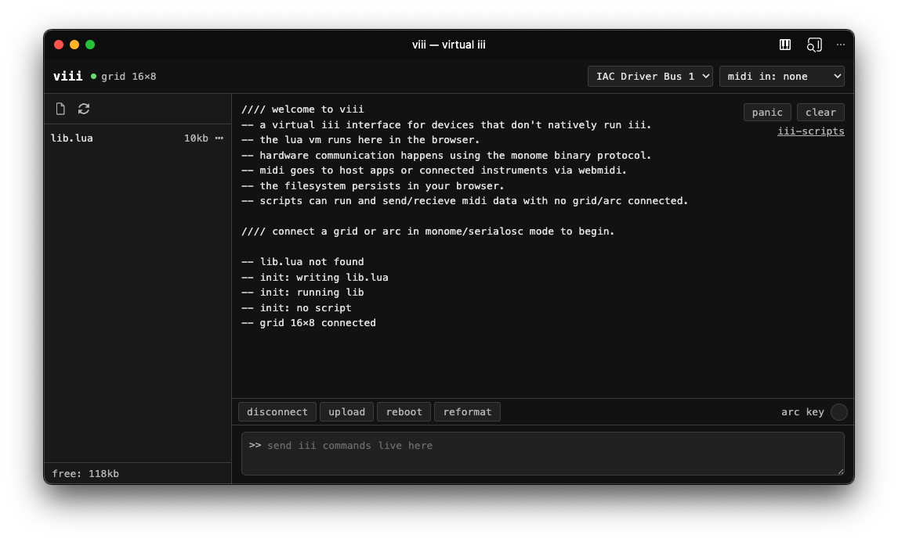

# viii

A virtual [iii](https://monome.org/docs/iii) interface that runs in the browser, designed to be compatible with grid and arc devices that don't natively support iii (older FTDI devices, older DIY grids, etc). The iii Lua VM, filesystem, and scripts all run right in your Chromium-based browser. Communication with the grid/arc happens using the same protocol as [serialosc](https://monome.org/docs/serialosc/) MIDI goes to host apps or connected instruments via WebMIDI.

No hardware is technically required — scripts can run and send/receive MIDI data with no grid or arc connected.

## Using viii

Go [here](https://dessertplanet.github.io/viii) in a browser that supports webserial/webmidi (Chromium, Chrome, Edge, Opera)

### Connecting a device

1. Quit serialosc (or any other app using the serial port) — the browser needs exclusive access
2. Click **connect** and select your grid or arc from the serial port picker

All monome grids and arcs that speak the mext protocol are supported — older FTDI-based editions, Neotrellis-based DIY grids, etc.

Note on Windows you will need to have an [FTDI Virtual COM Port driver](https://ftdichip.com/drivers/vcp-drivers/) for your device to appear if it uses an FTDI chip (older grids and arcs)

### Running scripts

- Use the **upload** button (or drag and drop) to add `.lua` scripts
- Click the **▶** button next to any `.lua` file in the file list
- Type `r` in the REPL to re-upload and run the last uploaded script (useful for iterating)
- Some scripts to get you started are available at [codeberg.org/tehn/iii-scripts](https://codeberg.org/tehn/iii-scripts)

### REPL

Type iii Lua commands directly in the input field and press Enter. A few shortcuts:

| Command | Action |
|---------|--------|
| `h` | Show help |
| `u` | Open file upload picker |
| `r` | Re-upload and run last uploaded script |
| `^^i` | Restart the VM |
| `^^c` | Clean restart (no script) |
| `help()` | Print the iii API reference |

### MIDI

Select MIDI output and input ports from the dropdowns in the header. The **panic** button sends All Notes Off on all 16 channels.

Note that to send midi to other apps on your host you may need to enable some kind of virtual MIDI loopback. On MacOS you can enable the IAC Driver device in Audio MIDI Setup for this. On Windows, one option I tested is the new [Windows MIDI Services](https://microsoft.github.io/MIDI/) that still require a manual install at the time of writing.

### Arc key

The **arc key** button in the toolbar sends `event_arc_key(1)` on press and `event_arc_key(0)` on release, simulating the physical arc push-switch that is absent on older arc models. You can also call these commands inside a script for the same effect or even map midi events to them for external control. For example:

```lua
-- Map MIDI note 21 to arc key event
-- event_midi receives raw MIDI bytes: status, data1, data2
local NOTE_ON = 0x90   -- note on status (channel in lower nibble)
local NOTE_OFF = 0x80  -- note off status
local STATUS_MASK = 0xF0
local TARGET_NOTE = 21

function event_midi(d1, d2, d3)
    local status = d1 & STATUS_MASK
    local note = d2
    local velocity = d3
    if note == TARGET_NOTE then
        if status == NOTE_ON and velocity > 0 then
            event_arc_key(1)
        elseif status == NOTE_OFF or (status == NOTE_ON and velocity == 0) then
            event_arc_key(0)
        end
    end
end
```

### Offline use

viii can be installed as a progressive web app. After the first visit, it works offline — the browser caches all assets. On supported browsers you can install it as a standalone web app from the address bar.

## Technical details for hacking viii

### For building

viii compiles iii and lua to Web Assembly (WASM) using the Emscripten framework.

- [Emscripten SDK](https://emscripten.org/docs/getting_started/downloads.html)

### Building

```sh
source /path/to/emsdk/emsdk_env.sh
make
```

This compiles everything to `web/viii.js` and `web/viii.wasm`.

To serve locally:

```sh
make serve
```

Then open `http://localhost:8080`.

### How it works

Platform-specific C modules in `src/` provide browser implementations:

| Module | Role |
|--------|------|
| `main.c` | WASM entry point, main loop, init |
| `device_web.c` | Grid/arc communication — mext TX (direct byte construction) and RX (inline parser) |
| `serial_web.c` | REPL text I/O between JS and the Lua VM |
| `midi_web.c` | WebMIDI bridge |
| `metro_web.c` | Timer management via JS shim |
| `fs_web.c` | Filesystem backed by IndexedDB |
| `flash_web.c` | Flash storage shim |

`bridge.js` ties everything together: WebSerial device connection, WebMIDI routing, REPL terminal, file management, and an `AudioContext`-driven timer that prevents background tab throttling.

### Device protocol

Grid and arc communication uses the monome mext binary protocol directly. LED output is constructed as raw mext bytes (matching the approach used in monome's [ansible](https://github.com/monome/ansible) firmware). Incoming key and encoder events are parsed by a lightweight inline mext message parser. All writes are padded to 64 bytes with `0xFF` for USB bulk packet alignment. Originally viii used libmonome directly but I found there were issues with different hardware versions and how wasm specifically was assembling the serial packets using structs instead of flat arrays like ansible. 

### Timing

The main loop and metro callbacks are driven by an `AudioContext` `ScriptProcessorNode` that fires at audio rate (~5.8ms). This approach is used because it is immune to Chromium's background tab throttling, ensuring stable timing even when the tab is not focused. Before the first user interaction (required by browser autoplay policy), a brief `setInterval` pump handles initial setup.

## Acknowledgements

viii is only possible because of the incredible ecosystem of open-source monome tooling and instrument firmware. A special thank you goes to [@tehn](https://github.com/tehn) for his encouragement and testing, for the iii framework, and for these awesome instruments! Another big thanks to [@okyeron](https://github.com/okyeron) for additional encouragement and testing + his incredible work on the neotrellis based grid and firmware. Other shoutouts include:

- [@jonwaterschoot](https://github.com/jonwaterschoot) and [@awesomebrick](https://github.com/awesomebrick) for testing
- [@schollz](https://github.com/schollz) for lending me his FTDI grid so that I could sort out compatibility issues
- [@philmillman](https://github.com/philmillman) for calling wasm to my attention in the first place

Important touchpoints from the monome open-source extended universe that were instrumental when making viii were:
- [libmonome](https://github.com/monome/libmonome)
- The [ansible](https://github.com/monome/ansible) and [norns](https://github.com/monome/norns) firmwares
- The [grid](https://codeberg.org/tehn/iii-grid-one) and [arc](https://codeberg.org/tehn/iii-arc) iii firmwares
- The [iii](https://codeberg.org/tehn/iii) platform itself
- The [diii](https://github.com/monome/web-diii) tool I made for monome that works with iii-compatible devices
